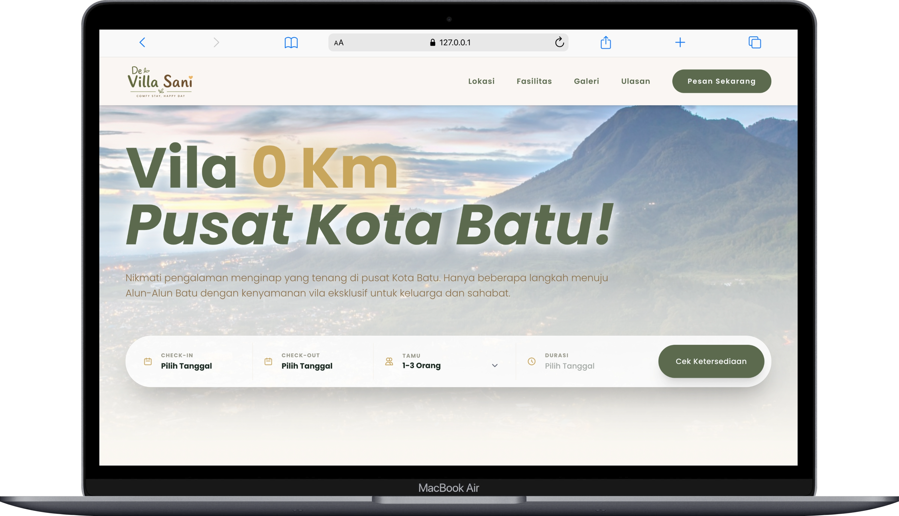

# 🏡 De Villa Sani Management System



A comprehensive booking and landing page system for **De Villa Sani**, a luxury premium villa located at the heart of Kota Wisata Batu (0 KM from Alun-Alun Batu).

## ✨ Key Features

- **Modern Landing Page**: Built with React & Framer Motion, offering an elegant, smooth, and responsive user experience with luxury aesthetics.
- **Interactive UI Components**:
  - 🖼️ Image Gallery Lightbox.
  - 📅 Interactive Date Range Picker for bookings.
  - 📱 Mobile-optimized segmented controls for Location/Access highlights (Smooth Crossfade Toggles).
  - ❓ Expandable Interactive FAQs.
  - ✨ Scroll Reveal animations for a premium feel.
- **Booking System**: Real-time date selection and availability checking.
- **Payment Gateway**: Seamless and secure transaction processing integrated with Midtrans (supports Virtual Accounts, E-Wallets, QRIS, etc.).
- **Admin Dashboard**: Secure backend powered by Laravel Breeze and Inertia for managing bookings, availability, and guest requests.
- **Luxury Design System**: Custom curated color palette (`luxury-olive`, `luxury-gold`, `luxury-sand`, etc.) combined with serif typography to convey exclusivity.

## 🛠️ Tech Stack

### Backend
- **Framework**: Laravel 13
- **Language**: PHP 8.3
- **Authentication**: Laravel Breeze
- **Payments**: Midtrans PHP
- **Database**: SQLite (Configurable to MySQL/PostgreSQL)

### Frontend
- **Framework**: React 18
- **State/Routing**: Inertia.js
- **Styling**: Tailwind CSS v4
- **Animations**: Framer Motion
- **Icons**: Lucide React

## 🚀 Getting Started

### Prerequisites
- PHP 8.3 or higher
- Node.js 18 or higher
- Composer

### Installation

1. **Clone the repository**
   ```bash
   git clone https://github.com/yourusername/villa-management.git
   cd villa-management
   ```

2. **Run the setup script**
   ```bash
   composer run setup
   ```
   *(This command automatically installs composer dependencies, creates `.env`, generates the app key, runs migrations, installs npm packages, and builds frontend assets)*.

3. **Configure Environment**
   Open `.env` and configure your local settings (Database, Mail, Midtrans, etc.).
   ```env
   DB_CONNECTION=sqlite
   # Add your Midtrans or other specific API keys here
   ```

4. **Start Development Server**
   ```bash
   composer run dev
   ```
   This will simultaneously run `php artisan serve` and `npm run dev` to serve the application at `http://localhost:8000`.

## 🎨 Design & Aesthetics
The UI/UX is heavily customized to deliver a premium, trustworthy, and relaxing vibe suitable for a family vacation villa. The design strictly avoids generic UI blocks, opting instead for organic overlaps, soft shadows, readable typography, and micro-animations.

## 📄 License
Private Repository. Copyright © 2026 De Villa Sani. All Rights Reserved.
